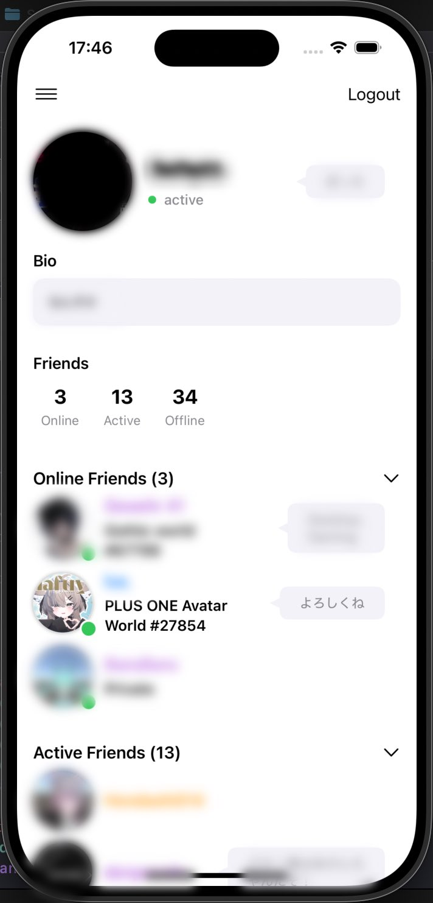
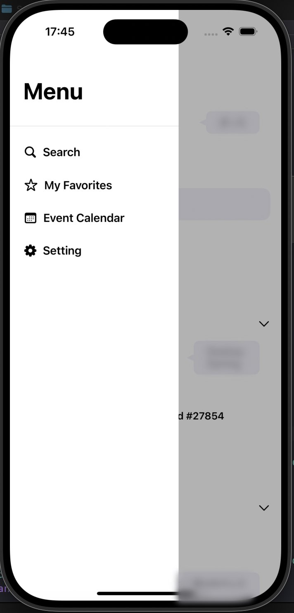
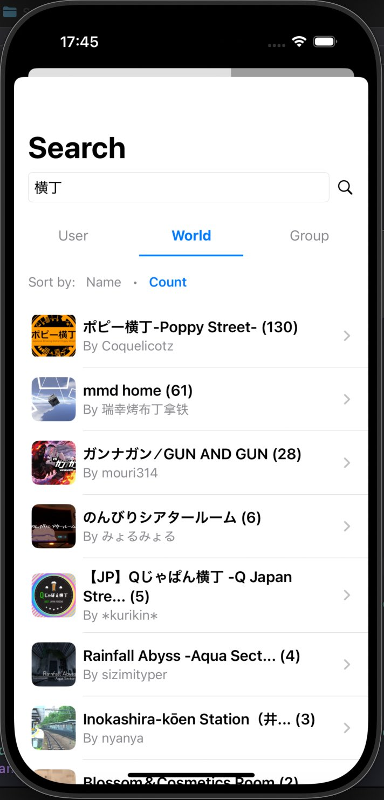
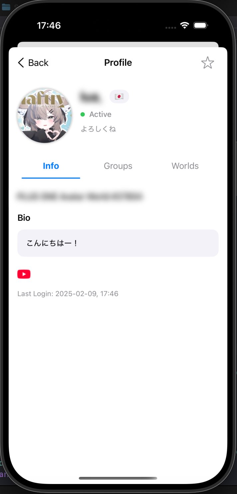

# VRCi  </img> 

**VRCi** is a next-generation friend and community management tool for VRChat on iOS—built with SwiftUI. This repository provides an overview of VRCi’s features and vision.

## Key Features

- **Real-Time Friend Status Updates**  
  Stay up-to-date with your friends’ online statuses through live WebSocket updates.

- **Favorites & Group Management**  
  Easily mark your favorite friends, worlds, and avatars and organize them into customizable groups.

- **Powerful Search Capabilities**  
  Search across users, worlds, groups, and avatars with advanced filtering and sorting options.

- **Modern UI/UX**  
  Enjoy a sleek, intuitive interface designed for the best user experience on iOS.

## Screenshots

Here are some screenshots showcasing VRCi’s key screens:

- **Main Screen**  
  

- **Menu**  
  

- **Search Screen**  
  

- **Friends Screen**  
  

## Current Development Status

VRCi is actively under development, with new features and improvements coming soon. A full release is on the horizon!

### TestFlight Beta Recruitment

We will soon begin recruiting beta testers via TestFlight. Sign up to gain early access and help shape the future of VRCi.

### Developer & Debugger Recruitment

We’re also looking for passionate developers and dedicated debuggers to join our team. If you’re interested in contributing to VRCi, please reach out!

## Sponsorship

To help support VRCi’s development, we welcome sponsorships. If you’d like to sponsor the project or collaborate with us, please contact us at [0x00002c000@tutanota.com](mailto:0x00002c000@tutanota.com).

---

Thank you for your interest in VRCi. We look forward to creating an exceptional VRChat management experience on iOS!
