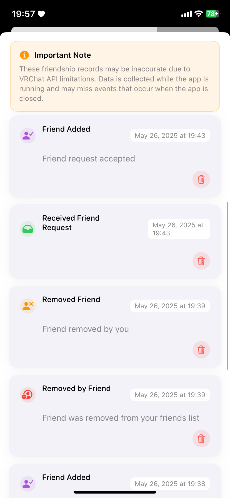

# VRCi  </img> 

**🇺🇸 English** • [🇯🇵 日本語](README_ja.md) • [🇪🇸 Español](README_es.md) • [🇨🇳 中文](README_cn.md) • [🇰🇷 한국어](README_kr.md)

**VRCi** is a next-generation friend and community management tool, inspired by [**VRCX**](https://github.com/vrcx-team/VRCX) for VRChat® on iOS—built with SwiftUI. 

This **unofficial third-party application** enhances your VRChat experience while respecting VRChat's ecosystem.

## Key Features

### **Native iOS Experience**
- **No Web Browser Required**: Direct access to all VRChat features through native iOS app
- **Instant Friend Location Tracking**: Real-time friend locations without app switching

### **Advanced Friend & Community Management**
- **Real-Time Friend Status Updates**: Live WebSocket updates for friend statuses
- **Comprehensive User Search**: Powerful search and filtering for any VRChat user
- **Favorites & Group Management**: Organize friends, worlds, and avatars into custom groups
- **Friendship Activity Tracking**: Detailed logs of friend requests, additions, and removals

### **World & Content Discovery**
- **Advanced World Search**: Discover worlds with detailed filtering and sorting
- **Content Browsing**: Explore avatars, worlds, and groups within the app
- **Favorite Management**: Save and organize content for later

### **Seamless Connectivity**
- **Enhanced QR Code Sharing**: Beautiful, customized QR codes with avatar and profile info
- **QR Code Scanner**: Instant friend adding by scanning VRCi QR codes
- **Multi-Account Support**: Secure storage and switching between up to 3 accounts

*And many more features coming soon!*

## Screenshots

Explore VRCi's comprehensive feature set:

<table align="center">
  <tr>
    <td align="center">
      <strong>Main Dashboard</strong> 
      
    </td>
    <td align="center">
      <strong>Side Menu</strong> 
      
    </td>
    <td align="center">
      <strong>My Profile</strong> 
      
    </td>
  </tr>
  <tr>
    <td align="center">
      <strong>Edit Profile</strong> 
      
    </td>
    <td align="center">
      <strong>Friendship Log</strong> 
      
    </td>
    <td align="center">
      <strong>QR Code Sharing</strong> 
      
    </td>
  </tr>
  <tr>
    <td align="center">
      <strong>World Search</strong> 
      
    </td>
    <td align="center">
      <strong>Group Management</strong> 
      
    </td>
    <td align="center">
      <strong>Settings & Preferences</strong> 
      
    </td>
  </tr>
</table>

## Legal & Compliance

VRCi is an **unofficial third-party application** developed independently and is not affiliated with or endorsed by VRChat Inc.

- **Complies with VRChat's Terms of Service**
- **Respects VRChat's Community Guidelines**  
- **Uses only public API endpoints**
- **Protects user privacy and data security**
- **Follows Apple's App Store Guidelines**

### Legal Documentation

**[Terms of Service](https://vrci-eula-deploy.vercel.app/terms)**  
Complete terms governing the use of VRCi

**[Privacy Policy](https://vrci-eula-deploy.vercel.app/privacy)**  
Detailed information about data collection, use, and protection

*VRChat® is a registered trademark of VRChat Inc. All rights reserved.*

## Current Development Status

**Beta testing will begin in early June 2025** via Apple's TestFlight platform. We're excited to share VRCi with the VRChat community and gather valuable feedback!

### Feature Ideas Always Welcome

We're constantly looking for ways to improve VRCi! If you have ideas for new features or improvements, we'd love to hear from you:
- **Submit feature requests** via GitHub Issues
- **Join discussions** in GitHub Discussions
- **Contact us directly** at vrci_admin@proton.me

Your input helps shape the future of VRCi!

### Developer Recruitment

**Calling all passionate iOS developers!** We're actively looking for talented developers who are excited about:
- **SwiftUI/UIKit development**
- **iOS platform expertise**  
- **VRChat community involvement**
- **Open source contribution**

Whether you're experienced or just starting out, if you're passionate about creating amazing iOS experiences for the VRChat community, we'd love to have you on the team!

---

**Thank you for your interest in VRCi!** We're committed to creating an exceptional VRChat companion experience on iOS that respects both the community and platform guidelines.

### Legal Links
[Terms of Service](https://vrci-eula-deploy.vercel.app/terms) • [Privacy Policy](https://vrci-eula-deploy.vercel.app/privacy) • [VRChat Terms](https://hello.vrchat.com/legal) • [VRChat Community Guidelines](https://hello.vrchat.com/community-guidelines)

