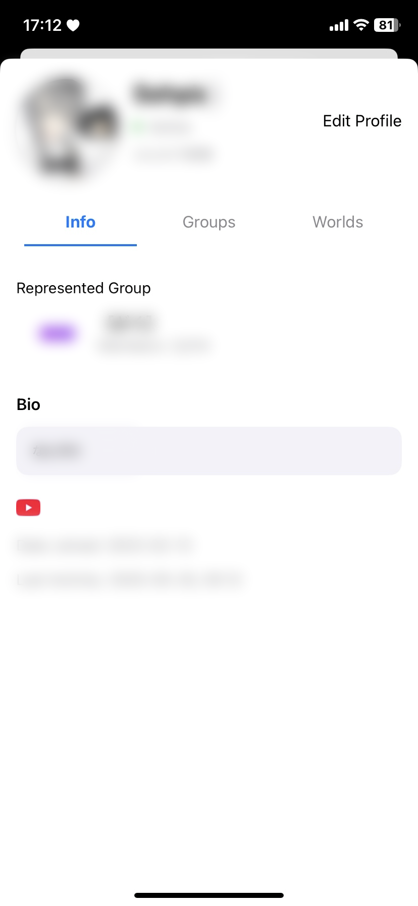

# VRCi  </img> 

**VRCi** is a next-generation friend and community management tool, inspired by [**VRCX**](https://github.com/vrcx-team/VRCX) for VRChat on iOS—built with SwiftUI. This **unofficial third-party application** enhances your VRChat experience while respecting VRChat's ecosystem.

## Key Features

### 🚀 **Native iOS Experience**
- **No Web Browser Required**: Access all VRChat features directly through the native iOS app—no need to visit VRChat's website
- **Instant Friend Location Tracking**: See where your friends are in real-time without switching between apps
- **Lightning-Fast Performance**: Optimized native SwiftUI interface for the smoothest experience

### 👥 **Advanced Friend & Community Management**
- **Real-Time Friend Status Updates**: Stay up-to-date with your friends' online statuses through live WebSocket updates
- **Comprehensive User Search**: Find any VRChat user with powerful search and filtering capabilities
- **Favorites & Group Management**: Easily mark your favorite friends, worlds, and avatars and organize them into customizable groups

### 🌍 **World & Content Discovery**
- **Advanced World Search**: Discover new worlds with detailed filtering, sorting, and recommendation features
- **Content Browsing**: Explore avatars, worlds, and groups without leaving the app
- **Wishlist Management**: Save and organize content you want to experience later

### 📱 **Seamless Connectivity**
- **Enhanced QR Code Sharing**: Share your VRChat profile with beautiful, customized QR codes featuring your avatar and information
- **QR Code Scanner**: Instantly add friends by scanning their VRCi QR codes—no typing required
- **Multi-Account Support**: Store and switch between up to 3 VRChat accounts with secure credential management

### ⚙️ **Professional Profile Tools**
- **Comprehensive Profile Management**: Edit your profile, manage bio links, languages, and status with an intuitive interface
- **Status History**: Keep track of your previous status messages for easy reuse
- **Privacy Controls**: Manage your visibility and interaction preferences

### 🎨 **Modern UI/UX**
- **iOS-Native Design**: Enjoy a sleek, intuitive interface designed specifically for iOS with full Dark Mode support
- **Accessibility First**: Built with VoiceOver and accessibility features for all users
- **Customizable Experience**: Personalize the app to match your preferences and workflow

*And many more features coming soon!*

## Screenshots

Explore VRCi's comprehensive feature set:

<table align="center">
  <tr>
    <td align="center">
      <strong>Main Dashboard</strong> 
      
       Friend status overview & quick access
    </td>
    <td align="center">
      <strong>My Profile</strong> 
      
       Personal profile management
    </td>
    <td align="center">
      <strong>Edit Profile</strong> 
      
       Comprehensive profile editing
    </td>
  </tr>
  <tr>
    <td align="center">
      <strong>QR Code Sharing</strong> 
      
       Beautiful QR cards for easy sharing
    </td>
    <td align="center">
      <strong>World Search</strong> 
      
       Discover worlds with advanced search
    </td>
    <td align="center">
      <strong>Group Management</strong> 
      
       Community and group organization
    </td>
  </tr>
  <tr>
    <td align="center" colspan="3">
      <strong>Settings & Preferences</strong> 
      
       Customizable app preferences
    </td>
  </tr>
</table>

## Legal & Compliance

VRCi is an **unofficial third-party application** developed independently and is not affiliated with or endorsed by VRChat Inc.

- ✅ **Complies with VRChat's Terms of Service**
- ✅ **Respects VRChat's Community Guidelines**  
- ✅ **Uses only public API endpoints**
- ✅ **Protects user privacy and data security**
- ✅ **Follows Apple's App Store Guidelines**

### Legal Documentation

📋 **[Terms of Service](https://vrci-eula-deploy.vercel.app/terms)**  
Complete terms governing the use of VRCi

🔒 **[Privacy Policy](https://vrci-eula-deploy.vercel.app/privacy)**  
Detailed information about data collection, use, and protection

*VRChat® is a registered trademark of VRChat Inc. All rights reserved.*

## Community Impact

VRCi aims to enhance the VRChat experience by:
- 🤝 **Improving friend and community management**
- ♿ **Providing better accessibility features**
- 🌱 **Supporting the VRChat ecosystem growth**
- ✨ **Fostering positive community interactions**
- 🔒 **Prioritizing user privacy and security**

## Current Development Status

🎉 **Development Phase Completed!** VRCi's core features are ready and optimized for release.

### 🚀 TestFlight Beta Launch - Early June 2025

**Beta testing will begin in early June 2025** via Apple's TestFlight platform. We're excited to share VRCi with the VRChat community and gather valuable feedback!

**What to expect in the beta:**
- ✅ Full feature access
- ✅ Real-time friend tracking
- ✅ QR code sharing and scanning
- ✅ Multi-account support
- ✅ Advanced search capabilities
- ✅ And much more!

### 💡 Feature Ideas Always Welcome

We're constantly looking for ways to improve VRCi! If you have ideas for new features or improvements, we'd love to hear from you:
- 🌟 **Submit feature requests** via GitHub Issues
- 💬 **Join discussions** in GitHub Discussions
- 📧 **Contact us directly** at vrci_admin@proton.me

Your input helps shape the future of VRCi!

### 👨‍💻 Developer Recruitment

**Calling all passionate iOS developers!** We're actively looking for talented developers who are excited about:
- 🔥 **SwiftUI/UIKit development**
- 📱 **iOS platform expertise**  
- 🎮 **VRChat community involvement**
- 🚀 **Open source contribution**

Whether you're experienced or just starting out, if you're passionate about creating amazing iOS experiences for the VRChat community, we'd love to have you on the team!

## Support Development

Help VRCi grow as the **premier iOS companion for VRChat**:

- ⭐ **Star this repository** to show your support
- 🐛 **Report bugs and suggest features** via GitHub Issues
- 🤝 **Contribute to development** - developers welcome!
- 💡 **Share your creative ideas** for new features
- 📢 **Tell your VRChat friends** about VRCi
- 📱 **Join our TestFlight beta** in early June 2025

*VRCi will always remain free and accessible to the VRChat community.*

## Contact & Community

- **General Contact**: vrci_admin@proton.me
- **GitHub**: [github.com/refiaa](https://github.com/refiaa)
- **Feature Ideas & Requests**: Use GitHub Issues
- **Community Discussions**: GitHub Discussions
- **Developer Applications**: vrci_admin@proton.me
- **Legal Inquiries**: vrci_admin@proton.me

### 🤝 Get Involved
- 💡 **Share your ideas** for new features
- 🐛 **Report bugs** to help us improve
- 👨‍💻 **Join our development team**
- 📢 **Spread the word** in the VRChat community

---

**Thank you for your interest in VRCi!** We're committed to creating an exceptional VRChat companion experience on iOS that respects both the community and platform guidelines.

### Legal Links
[Terms of Service](https://vrci-eula-deploy.vercel.app/terms) • [Privacy Policy](https://vrci-eula-deploy.vercel.app/privacy) • [VRChat Terms](https://hello.vrchat.com/legal) • [VRChat Community Guidelines](https://hello.vrchat.com/community-guidelines)

*Built with ❤️ for the VRChat community*

