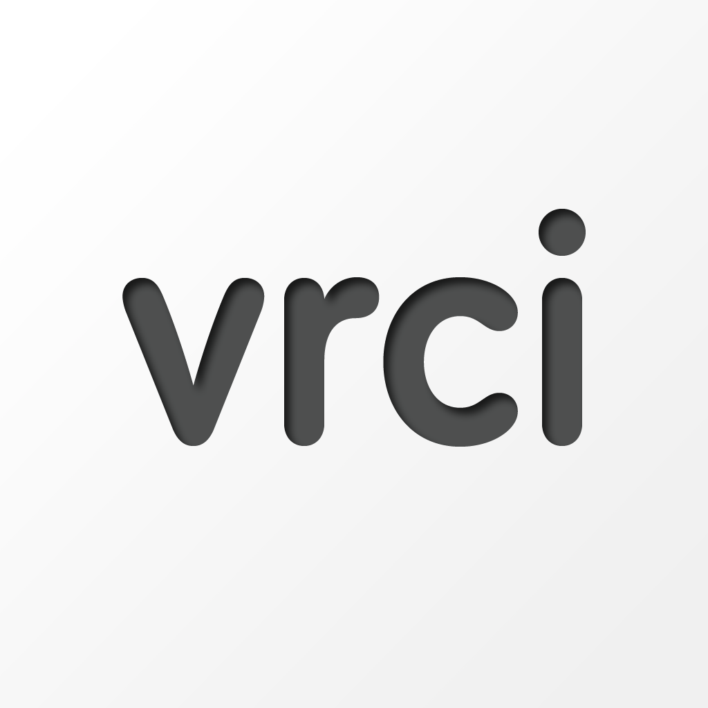

# VRCi  </img>

[🇺🇸 English](README.md) • [🇯🇵 日本語](README_ja.md) • [🇪🇸 Español](README_es.md) • [🇨🇳 中文](README_cn.md) • [🇰🇷 한국어](README_kr.md) • **🇩🇪 Deutsch**

**VRCi** ist ein Next-Generation-Tool zur Freundes- und Communityverwaltung, inspiriert von [**VRCX**](https://github.com/vrcx-team/VRCX) für VRChat® auf iOS - entwickelt mit SwiftUI. 

Diese **inoffizielle Drittanbieter-App** verbessert dein VRChat-Erlebnis, während sie das VRChat-Ökosystem respektiert.

**Kompatibel mit iPhone und iPad** • **Erfordert iOS 18.0 oder neuer**

[Change Log](CHANGELOG.md)

## Hauptfunktionen

### **Native iOS-Erfahrung**
- **Kein Webbrowser erforderlich**: Direkter Zugriff auf alle VRChat-Funktionen über die native iOS-App
- **Sofortiges Freundes-Tracking**: Echtzeit-Ortung von Freunden ohne App-Wechsel

### **Erweiterte Freundes- & Communityverwaltung**
- **Echtzeit-Statusaktualisierungen**: Live-WebSocket-Updates für Freundesstatus
- **Umfassende Benutzersuche**: Leistungsstarke Suche und Filterung für jeden VRChat-Nutzer
- **Favoriten- & Gruppenverwaltung**: Organisiere Freunde, Welten und Avatare in benutzerdefinierten Gruppen
- **Freundschaftsaktivität-Tracking**: Detaillierte Protokolle über Freundesanfragen, Hinzufügungen und Entfernungen

### **Welt- & Inhaltsentdeckung**
- **Erweiterte Weltensuche**: Entdecke Welten mit detaillierten Filter- und Sortieroptionen
- **Inhaltsdurchsuchung**: Erkunde Avatare, Welten und Gruppen innerhalb der App
- **Favoritenverwaltung**: Speichere und organisiere Inhalte für später

### **Nahtlose Konnektivität**
- **Verbessertes QR-Code-Sharing**: Schöne, individuell gestaltete QR-Codes mit Avatar- und Profilinformationen
- **QR-Code-Scanner**: Sofortiges Hinzufügen von Freunden durch Scannen von VRCi-QR-Codes
- **Multi-Account-Unterstützung**: Sichere Speicherung und Wechsel zwischen bis zu 3 Konten

*Und viele weitere Funktionen zu entdecken!*

## Screenshots

Entdecke die verschiedenen Funktionen von VRCi:

<table align="center">
  <tr>
    <td align="center">
      <strong>Startseite</strong> 
      
    </td>
    <td align="center">
      <strong>Navigationsleiste</strong> 
      
    </td>
    <td align="center">
      <strong>Mein Profil</strong> 
      
    </td>
  </tr>
  <tr>
    <td align="center">
      <strong>Profil bearbeiten</strong> 
      
    </td>
    <td align="center">
      <strong>Freundschaftsprotokoll</strong> 
      
    </td>
    <td align="center">
      <strong>Teilbarer QR-Code</strong> 
      
    </td>
  </tr>
  <tr>
    <td align="center">
      <strong>Weltensuche</strong> 
      
    </td>
    <td align="center">
      <strong>Gruppenverwaltung</strong> 
      
    </td>
    <td align="center">
      <strong>Einstellungen und Präferenzen</strong> 
      
    </td>
  </tr>
</table>

## Systemanforderungen

- **Plattform**: iPhone und iPad
- **iOS-Version**: iOS 18.0 oder neuer
- **Internetverbindung**: Erforderlich für den Zugriff auf die VRChat-API
- **Speicherplatz**: Ca. 50 MB freier Speicher erforderlich

## Download & Installation

VRCi ist jetzt im App Store verfügbar! Lade es einfach herunter und beginne mit der verbesserten VRChat-Verwaltung auf deinem iOS-Gerät.

**[VRCi im App Store herunterladen](https://apps.apple.com/us/app/vrci/id6746643250)**

## Rechtliches & Compliance

VRCi ist eine **inoffizielle Drittanbieter-App**, die unabhängig entwickelt wurde und nicht mit VRChat Inc. verbunden oder von dieser unterstützt wird.

- **Entspricht den Nutzungsbedingungen von VRChat**
- **Respektiert die Community-Richtlinien von VRChat**  
- **Verwendet nur öffentliche API-Endpunkte**
- **Schützt die Privatsphäre und Datensicherheit der Nutzer**
- **Befolgt die Richtlinien des App Stores von Apple**

### Rechtliche Dokumente

**[Nutzungsbedingungen](https://vrci-eula-deploy.vercel.app/terms)**  
Vollständige Bedingungen für die Nutzung von VRCi

**[Datenschutzerklärung](https://vrci-eula-deploy.vercel.app/privacy)**  
Detaillierte Informationen zur Datenerfassung, -nutzung und -sicherheit

*VRChat® ist eine eingetragene Marke von VRChat Inc. Alle Rechte vorbehalten.*

## Support & Feedback

Jetzt, da VRCi im App Store verfügbar ist, freuen wir uns auf dein Feedback! Deine Rückmeldungen helfen uns, die App weiter zu verbessern.

### Kontaktmöglichkeiten
- **App Store-Bewertungen**: Gib Feedback direkt im App Store ab
- **GitHub Issues**: Melde Fehler oder schlage neue Funktionen vor
- **GitHub Discussions**: Tritt der Community-Diskussion bei
- **Direkter Kontakt**: Schreibe uns an vrci_admin@proton.me

### Funktionsvorschläge willkommen

Wir suchen ständig nach Wegen, VRCi zu verbessern! Wenn du Ideen für neue Funktionen oder Verbesserungen hast, teile sie uns gerne über einen der oben genannten Kanäle mit.

### Entwickler gesucht

**An alle leidenschaftlichen iOS-Entwickler!** Wir suchen aktiv nach talentierten Entwicklern, die begeistert sind von:
- **SwiftUI/UIKit-Entwicklung**
- **iOS-Plattform-Expertise**  
- **Engagement in der VRChat-Community**
- **Open-Source-Beiträgen**

Egal ob du erfahren oder neu dabei bist - wenn du begeistert bist, großartige iOS-Erlebnisse für die VRChat-Community zu schaffen, freuen wir uns, dich im Team zu haben!

---

**Vielen Dank für das Herunterladen von VRCi!** Wir sind bestrebt, ein außergewöhnliches VRChat-Begleiterlebnis auf iOS zu schaffen, das sowohl die Community als auch die Plattformrichtlinien respektiert.

### Rechtliche Links
[Terms of Service](https://vrci-eula-deploy.vercel.app/terms) • [Privacy Policy](https://vrci-eula-deploy.vercel.app/privacy) • [VRChat Terms](https://hello.vrchat.com/legal) • [VRChat Community Guidelines](https://hello.vrchat.com/community-guidelines)

VRCi wird nicht von VRChat unterstützt und spiegelt nicht die Ansichten oder Meinungen von VRChat oder Personen wider, die offiziell an der Entwicklung oder Verwaltung von VRChat beteiligt sind. VRChat und alle zugehörigen Eigenschaften sind Marken oder eingetragene Marken von VRChat Inc. VRChat © VRChat Inc.