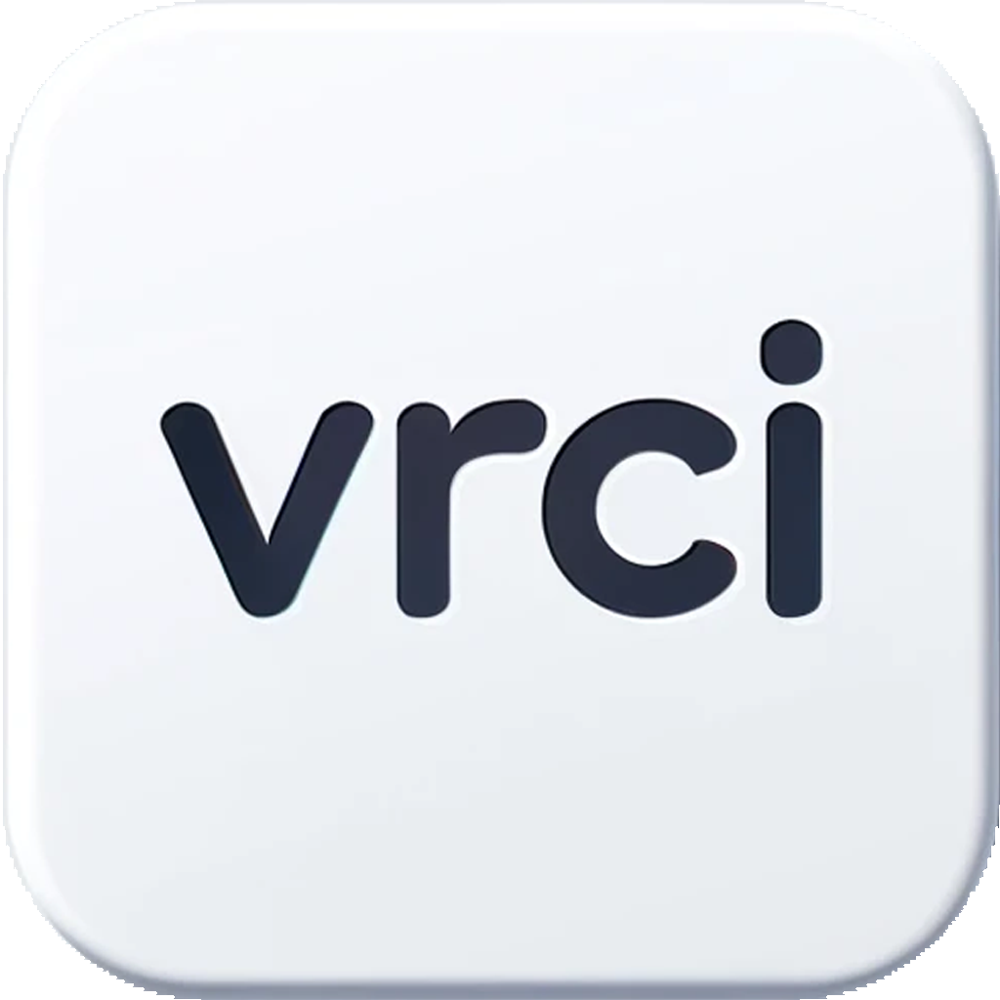
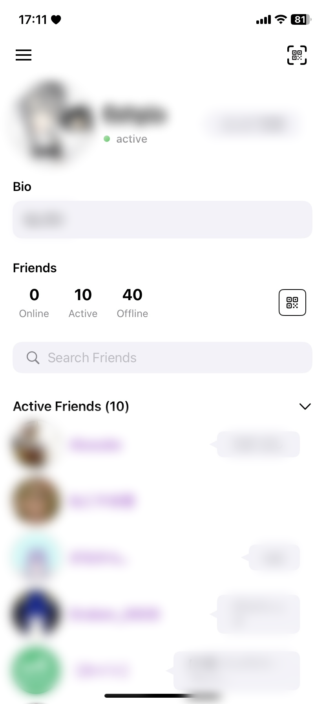
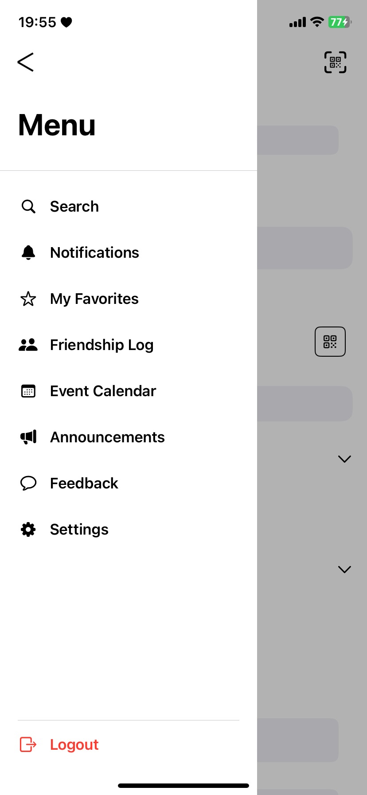
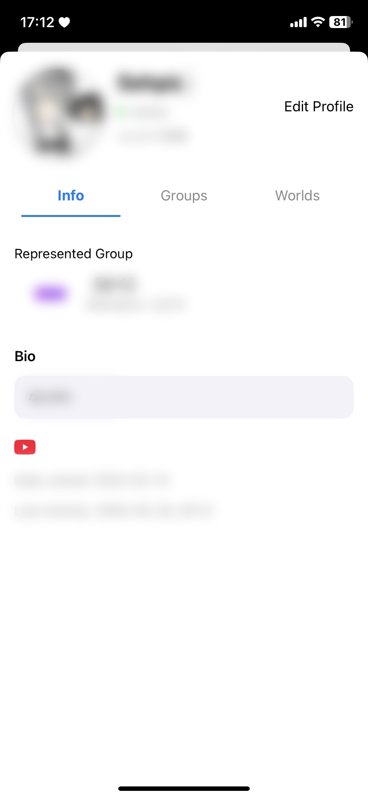
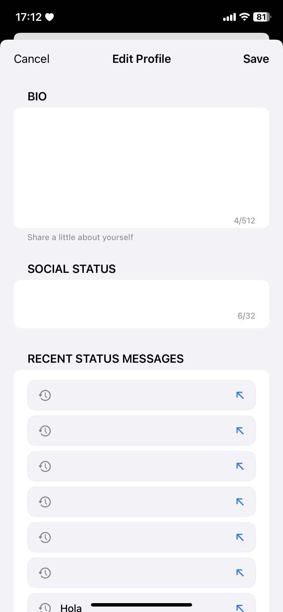
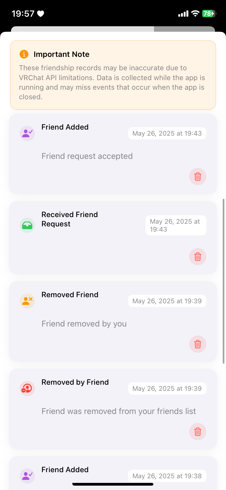
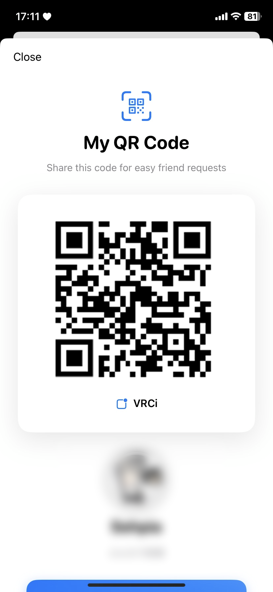
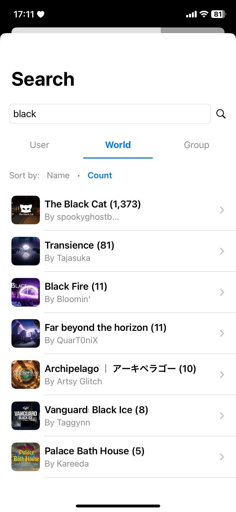
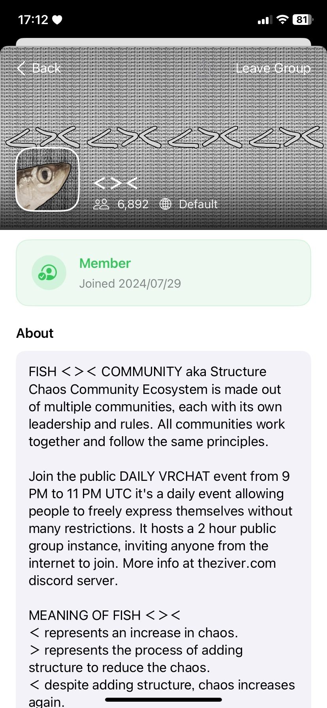
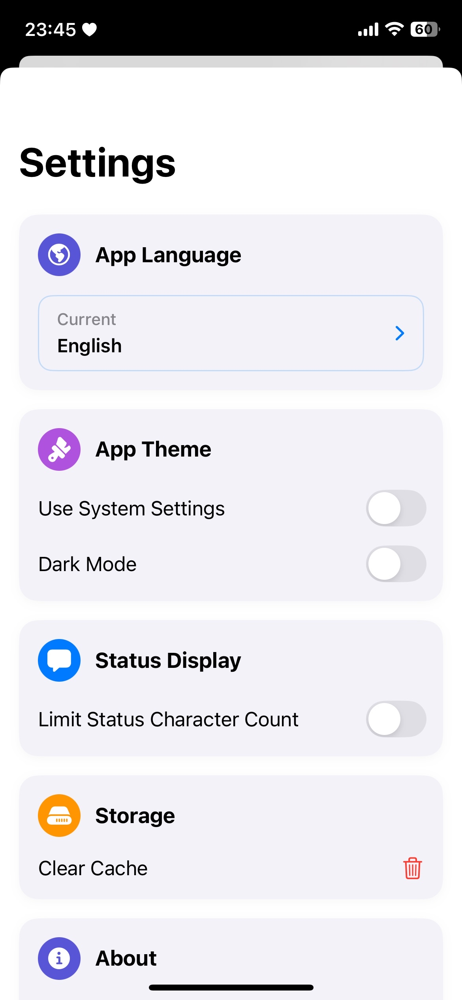

# VRCi  </img>

[🇺🇸 English](README.md) • [🇯🇵 日本語](README_ja.md) • **🇪🇸 Español** • [🇨🇳 中文](README_cn.md) • [🇰🇷 한국어](README_kr.md)

**VRCi** es la herramienta de nueva generación para la gestión de amigos y comunidades, inspirada en [**VRCX**](https://github.com/vrcx-team/VRCX) para VRChat® en iOS, desarrollada con SwiftUI.

Esta **aplicación no oficial de terceros** mejora tu experiencia en VRChat respetando al mismo tiempo el ecosistema de VRChat.

*This readme.md for Espanol is translated by Google Gemini*

## Características Destacadas

### **Experiencia Nativa de iOS**
- **Sin Necesidad de Navegador Web**: Accede a todas las funciones de VRChat directamente través de la app nativa de iOS
- **Seguimiento Instantáneo de Amigos**: Ve dónde están tus amigos en tiempo real sin cambiar entre aplicaciones

### **Gestión Avanzada de Amigos y Comunidades**
- **Actualizaciones en Tiempo Real**: Mantente al día con los estados de tus amigos mediante actualizaciones WebSocket en vivo
- **Búsqueda Exhaustiva de Usuarios**: Encuentra cualquier usuario de VRChat con potentes capacidades de búsqueda y filtrado
- **Gestión de Favoritos y Grupos**: Marca y organiza tus amigos, mundos y avatares favoritos en grupos personalizables
- **Seguimiento de Actividad de Amistad**: Registros detallados de solicitudes, adiciones y eliminaciones de amigos

### **Descubrimiento de Mundos y Contenido**
- **Búsqueda Avanzada de Mundos**: Descubre nuevos mundos con funciones detalladas de filtrado y clasificación
- **Exploración de Contenido**: Explora avatares, mundos y grupos dentro de la aplicación
- **Gestión de Favoritos**: Guarda y organiza el contenido que quieres experimentar más tarde

### **Conectividad Fluida**
- **Compartir Códigos QR Mejorado**: Hermosos códigos QR personalizados con tu avatar e información de perfil
- **Escáner de Códigos QR**: Añade amigos al instante escaneando códigos QR de VRCi
- **Soporte Multicuenta**: Almacenamiento seguro y cambio entre hasta 3 cuentas de VRChat

*¡Y muchas más funciones próximamente!*

## Capturas de Pantalla

Explora el completo conjunto de características de VRCi:

<table align="center">
  <tr>
    <td align="center">
      <strong>Panel Principal</strong> 
      
       Resumen del estado de amigos y acceso rápido
    </td>
    <td align="center">
      <strong>Menú Lateral</strong> 
      
       Navegación fácil y acceso a funciones
    </td>
    <td align="center">
      <strong>Mi Perfil</strong> 
      
       Gestión del perfil personal
    </td>
  </tr>
  <tr>
    <td align="center">
      <strong>Editar Perfil</strong> 
      
       Edición completa del perfil
    </td>
    <td align="center">
      <strong>Registro de Amistad</strong> 
      
       Seguimiento de todas las actividades de amistad
    </td>
    <td align="center">
      <strong>Compartir Código QR</strong> 
      
       Hermosas tarjetas QR para compartir fácilmente
    </td>
  </tr>
  <tr>
    <td align="center">
      <strong>Búsqueda de Mundos</strong> 
      
       Descubre mundos con búsqueda avanzada
    </td>
    <td align="center">
      <strong>Gestión de Grupos</strong> 
      
       Organización de comunidades y grupos
    </td>
    <td align="center">
      <strong>Ajustes y Preferencias</strong> 
      
       Preferencias personalizables de la aplicación
    </td>
  </tr>
</table>

## Legal y Cumplimiento

VRCi es una **aplicación no oficial de terceros** desarrollada de forma independiente y no está afiliada ni respaldada por VRChat Inc.

- **Cumple con los Términos de Servicio de VRChat**
- **Respeta las Directrices de la Comunidad de VRChat**
- **Utiliza solo puntos finales de API públicos**
- **Protege la privacidad y seguridad de los datos del usuario**
- **Sigue las Directrices de la App Store de Apple**

### Documentación Legal

**[Términos de Servicio](https://vrci-eula-deploy.vercel.app/terms)**
Términos completos que rigen el uso de VRCi

**[Política de Privacidad](https://vrci-eula-deploy.vercel.app/privacy)**
Información detallada sobre la recopilación, uso y protección de datos

*VRChat® es una marca registrada de VRChat Inc. Todos los derechos reservados.*

## Estado Actual del Desarrollo

**Las pruebas beta comenzarán a principios de junio de 2025** a través de la plataforma TestFlight de Apple. ¡Estamos emocionados de compartir VRCi con la comunidad de VRChat y recopilar comentarios valiosos!

### Las Ideas para Funciones Siempre Son Bienvenidas

¡Estamos constantemente buscando formas de mejorar VRCi! Si tienes ideas para nuevas funciones o mejoras, nos encantaría escucharte:
- **Envía solicitudes de funciones** a través de GitHub Issues
- **Únete a las discusiones** en GitHub Discussions
- **Contáctanos directamente** en vrci_admin@proton.me

¡Tu opinión ayuda a dar forma al futuro de VRCi!

### Reclutamiento de Desarrolladores

**¡Llamando a todos los desarrolladores de iOS apasionados!** Estamos buscando activamente desarrolladores talentosos que estén entusiasmados con:
- **Desarrollo en SwiftUI/UIKit**
- **Experiencia en la plataforma iOS**
- **Participación en la comunidad de VRChat**
- **Contribución al código abierto**

Tanto si tienes experiencia como si estás empezando, si te apasiona crear experiencias increíbles de iOS para la comunidad de VRChat, ¡nos encantaría tenerte en el equipo!

---

**¡Gracias por tu interés en VRCi!** Estamos comprometidos a crear una experiencia excepcional como compañero de VRChat en iOS que respete tanto a la comunidad como las directrices de la plataforma.

### Enlaces Legales
[Términos de Servicio](https://vrci-eula-deploy.vercel.app/terms) • [Política de Privacidad](https://vrci-eula-deploy.vercel.app/privacy) • [Términos de VRChat](https://hello.vrchat.com/legal) • [Directrices de la Comunidad de VRChat](https://hello.vrchat.com/community-guidelines)

VRCi is not endorsed by VRChat and does not reflect the views or opinions of VRChat or anyone officially involved in producing or managing VRChat properties. VRChat and all associated properties are trademarks or registered trademarks of VRChat Inc. VRChat © VRChat Inc.