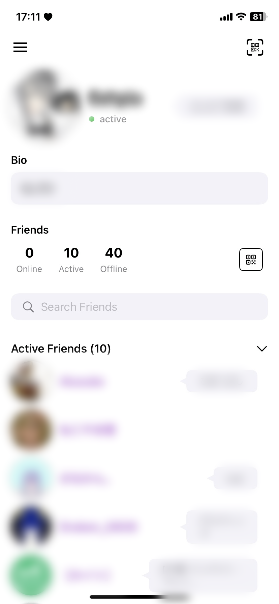
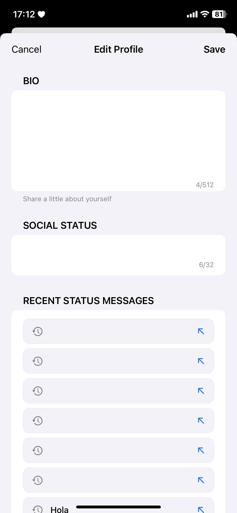

# VRCi  </img>

[🇺🇸 English](README.md) • **🇯🇵 日本語** • [🇪🇸 Español](README_es.md) • [🇨🇳 中文](README_cn.md) • [🇰🇷 한국어](README_kr.md)

**VRCi**は、iOSのためのVRChat用次世代フレンド＆コミュニティ管理ツールです。[**VRCX**](https://github.com/vrcx-team/VRCX)から着想を得て、SwiftUIで構築されました。

この**非公式サードパーティアプリケーション**は、VRChatのエコシステムを尊重しつつ、あなたのVRChat体験を向上させます。

## 主な機能

### **ネイティブiOS体験**
- **ブラウザ不要**: ネイティブiOSアプリから直接VRChatの全機能にアクセス
- **瞬時のフレンド位置追跡**: アプリ切り替えなしでリアルタイムのフレンド位置確認

### **高度なフレンド＆コミュニティ管理**
- **リアルタイムフレンドステータス更新**: WebSocketによるライブステータス更新
- **包括的なユーザー検索**: 強力な検索・フィルタリング機能
- **お気に入り＆グループ管理**: フレンド、ワールド、アバターをカスタムグループで整理

### **ワールド＆コンテンツ発見**
- **高度なワールド検索**: 詳細なフィルタリング・ソートでワールドを発見
- **コンテンツブラウジング**: アプリ内でアバター、ワールド、グループを探索
- **お気に入り管理**: 後で使用するコンテンツの保存・整理

### **シームレスな接続性**
- **強化されたQRコード共有**: アバターとプロフィール情報付きの美しいQRコード
- **QRコードスキャナー**: VRCi QRコードをスキャンして瞬時にフレンド追加
- **マルチアカウント対応**: 最大3つのアカウントの安全な保存・切り替え

*その他多くの機能が近日公開予定！*

## スクリーンショット

VRCiの包括的な機能をご覧ください：

<table align="center">
  <tr>
    <td align="center">
      <strong>メインダッシュボード</strong> 
      
    </td>
    <td align="center">
      <strong>サイドメニュー</strong> 
      
    </td>
    <td align="center">
      <strong>マイプロフィール</strong> 
      
    </td>
  </tr>
  <tr>
    <td align="center">
      <strong>プロフィール編集</strong> 
      
    </td>
    <td align="center">
      <strong>フレンドシップログ</strong> 
      
    </td>
    <td align="center">
      <strong>QRコード共有</strong> 
      
    </td>
  </tr>
  <tr>
    <td align="center">
      <strong>ワールド検索</strong> 
      
    </td>
    <td align="center">
      <strong>グループ管理</strong> 
      
    </td>
    <td align="center">
      <strong>設定と環境設定</strong> 
      
    </td>
  </tr>
</table>

## 法的情報とコンプライアンス

VRCiは独立して開発された**非公式サードパーティアプリケーション**であり、VRChat Inc.とは一切関係がなく、VRChat Inc.による承認も受けていません。

- **VRChatの利用規約を遵守**
- **VRChatのコミュニティガイドラインを尊重**
- **公開APIエンドポイントのみを使用**
- **ユーザーのプライバシーとデータセキュリティを保護**
- **AppleのApp Storeガイドラインに従順**

### 法的文書

**[利用規約](https://vrci-eula-deploy.vercel.app/terms)**  
VRCiのご利用に関する完全な規約

**[プライバシーポリシー](https://vrci-eula-deploy.vercel.app/privacy)**  
データの収集、使用、保護に関する詳細情報

*VRChat®はVRChat Inc.の登録商標です。無断複写・転載を禁じます。*

## 現在の開発状況

**ベータテストは2025年初夏に**AppleのTestFlightプラットフォームを通じて開始されます。VRCiをVRChatコミュニティと共有し、貴重なフィードバックを収集できることを楽しみにしています！

### 機能に関するアイデアを常時募集中

私たちは常にVRCiを改善する方法を探しています！新機能や改善に関するアイデアがございましたら、ぜひお聞かせください：
- GitHub Issues経由で**機能リクエストを送信**
- GitHub Discussionsで**ディスカッションに参加**
- vrci_admin@proton.meまで**直接お問い合わせ**

あなたの意見がVRCiの未来を形作ります！

### 開発者募集

**情熱的なiOS開発者の皆さんを募集しています！** 私たちは、以下に情熱を燃やす才能ある開発者を積極的に探しています：
- **SwiftUI/UIKit開発**
- **iOSプラットフォームの専門知識**
- **VRChatコミュニティへの参加**
- **オープンソースへの貢献**

経験者の方も、これからの方も、VRChatコミュニティのために素晴らしいiOS体験を創造することに情熱をお持ちであれば、ぜひチームにご参加ください！

---

**VRCiにご関心をお寄せいただき、ありがとうございます！** 私たちは、コミュニティとプラットフォームのガイドライン双方を尊重し、iOS上で卓越したVRChatコンパニオン体験を創造することに全力を尽くしています。

### 法的リンク
[利用規約](https://vrci-eula-deploy.vercel.app/terms) • [プライバシーポリシー](https://vrci-eula-deploy.vercel.app/privacy) • [VRChat利用規約](https://hello.vrchat.com/legal) • [VRChatコミュニティガイドライン](https://hello.vrchat.com/community-guidelines)

