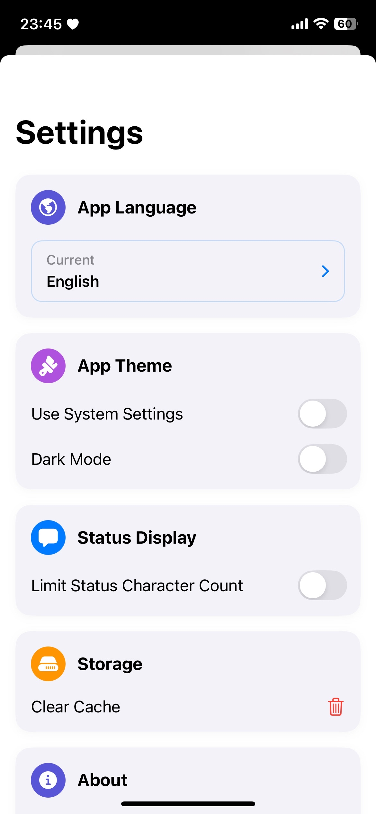

# VRCi  </img>

[🇺🇸 English](README.md) • [🇯🇵 日本語](README_ja.md) • [🇪🇸 Español](README_es.md) • [🇨🇳 中文](README_cn.md) • [🇰🇷 한국어](README_kr.md)

**VRCi**는 SwiftUI로 제작된 iOS용 VRChat을 위한 차세대 친구 및 커뮤니티 관리 도구로, [**VRCX**](https://github.com/vrcx-team/VRCX)에서 영감을 받았습니다. 이 **비공식 서드파티 애플리케이션**은 VRChat 생태계를 존중하며 여러분의 VRChat 경험을 한층 더 향상시켜 줍니다.

*이 Readme.md는 Google Gemini에 의해 번역되었습니다.*

## 주요 기능

### 🚀 **네이티브 iOS 경험**
- **웹 브라우저 불필요**: VRChat 웹사이트를 방문할 필요 없이, iOS 앱에서 모든 VRChat 기능을 직접 경험하세요.
- **실시간 친구 위치 추적**: 앱을 오갈 필요 없이 친구들이 어디에 있는지 실시간으로 확인하세요.
- **번개처럼 빠른 성능**: 최적화된 네이티브 SwiftUI 인터페이스로 가장 부드러운 경험을 선사합니다.

### 👥 **향상된 친구 및 커뮤니티 관리**
- **실시간 친구 상태 업데이트**: 실시간 WebSocket 업데이트로 친구들의 온라인 상태를 놓치지 마세요.
- **포괄적인 사용자 검색**: 강력한 검색 및 필터링 기능으로 모든 VRChat 사용자를 찾아보세요.
- **즐겨찾기 및 그룹 관리**: 즐겨찾는 친구, 월드, 아바타를 손쉽게 표시하고 사용자 설정 그룹으로 정리하세요.

### 🌍 **월드 및 콘텐츠 탐색**
- **고급 월드 검색**: 상세한 필터링, 정렬, 추천 기능으로 새로운 월드를 발견하세요.
- **콘텐츠 브라우징**: 앱을 나가지 않고도 아바타, 월드, 그룹을 탐색하세요.
- **위시리스트 관리**: 나중에 경험하고 싶은 콘텐츠를 저장하고 정리하세요.

### 📱 **끊김 없는 연결성**
- **향상된 QR 코드 공유**: 여러분의 아바타와 정보가 담긴 아름답고 맞춤화된 QR 코드로 VRChat 프로필을 공유하세요.
- **QR 코드 스캐너**: 친구의 VRCi QR 코드를 스캔하여 타이핑 없이 즉시 친구를 추가하세요.
- **다중 계정 지원**: 최대 3개의 VRChat 계정을 안전한 자격 증명 관리와 함께 저장하고 전환하세요.

### ⚙️ **전문적인 프로필 도구**
- **포괄적인 프로필 관리**: 직관적인 인터페이스로 프로필을 편집하고, 소개 링크, 언어, 상태를 관리하세요.
- **상태 메시지 기록**: 이전 상태 메시지를 추적하여 손쉽게 재사용하세요.
- **개인 정보 보호 설정**: 공개 범위 및 상호 작용 환경 설정을 관리하세요.

### 🎨 **현대적인 UI/UX**
- **iOS 네이티브 디자인**: iOS에 최적화된 세련되고 직관적인 디자인을 만나보세요. 완벽한 다크 모드 지원은 물론입니다.
- **손쉬운 사용 우선**: 모든 사용자를 위해 VoiceOver 및 손쉬운 사용 기능으로 제작되었습니다.
- **맞춤형 경험**: 여러분의 취향과 작업 흐름에 맞게 앱을 개인화하세요.

*더 많은 기능들이 곧 추가될 예정입니다!*

## 스크린샷

VRCi의 포괄적인 기능들을 살펴보세요:

<table align="center">
  <tr>
    <td align="center">
      <strong>메인 대시보드</strong> 
      
       친구 상태 개요 및 빠른 접근
    </td>
    <td align="center">
      <strong>내 프로필</strong> 
      
       개인 프로필 관리
    </td>
    <td align="center">
      <strong>프로필 편집</strong> 
      
       포괄적인 프로필 편집
    </td>
  </tr>
  <tr>
    <td align="center">
      <strong>QR 코드 공유</strong> 
      
       손쉬운 공유를 위한 아름다운 QR 카드
    </td>
    <td align="center">
      <strong>월드 검색</strong> 
      
       고급 검색으로 월드 발견
    </td>
    <td align="center">
      <strong>그룹 관리</strong> 
      
       커뮤니티 및 그룹 구성
    </td>
  </tr>
  <tr>
    <td align="center" colspan="3">
      <strong>설정 및 환경설정</strong> 
      
       맞춤형 앱 환경설정
    </td>
  </tr>
</table>

## 법률 및 규정 준수

VRCi는 독립적으로 개발된 **비공식 서드파티 애플리케이션**이며 VRChat Inc.와 제휴하거나 보증하지 않습니다.

- **VRChat 서비스 약관 준수**
- **VRChat 커뮤니티 가이드라인 존중**
- **공개 API 엔드포인트만 사용**
- **사용자 개인 정보 및 데이터 보안 보호**
- **Apple 앱스토어 가이드라인 준수**

### 법률 문서

📋 **[서비스 약관](https://vrci-eula-deploy.vercel.app/terms)**
VRCi 사용에 관한 전체 약관

🔒 **[개인정보 처리방침](https://vrci-eula-deploy.vercel.app/privacy)**
데이터 수집, 사용 및 보호에 대한 상세 정보

*VRChat®은 VRChat Inc.의 등록 상표입니다.*

## 커뮤니티에 미치는 영향

VRCi는 다음을 통해 VRChat 경험을 향상시키는 것을 목표로 합니다:
- **친구 및 커뮤니티 관리 개선**
- **더 나은 손쉬운 사용 기능 제공**
- **VRChat 생태계 성장 지원**
- **긍정적인 커뮤니티 상호 작용 촉진**
- **사용자 개인 정보 및 보안 우선**

## 현재 개발 상태

**개발 단계 완료!** VRCi의 핵심 기능들이 출시를 위해 준비되고 최적화되었습니다.

### TestFlight 베타 출시 - 2025년 6월 초

**베타 테스트는 2025년 6월 초** Apple의 TestFlight 플랫폼을 통해 시작될 예정입니다. VRCi를 VRChat 커뮤니티와 공유하고 소중한 피드백을 받을 수 있기를 기대합니다!

📝 **베타 신청 곧 시작!** 곧 Google Form을 통해 베타 신청을 받을 예정입니다. 공지를 기다려 주세요!

**베타 버전에서 기대할 수 있는 것들:**
- 모든 기능 이용 가능
- 실시간 친구 추적
- QR 코드 공유 및 스캔
- 다중 계정 지원
- 고급 검색 기능
- 그리고 훨씬 더 많은 기능들!

### 기능 아이디어는 언제나 환영합니다

저희는 VRCi를 개선할 방법을 끊임없이 찾고 있습니다! 새로운 기능이나 개선 사항에 대한 아이디어가 있다면 언제든지 알려주세요:
- GitHub Issues를 통해 **기능 요청 제출**
- GitHub Discussions에서 **토론 참여**
- vrci_admin@proton.me으로 **직접 문의**

여러분의 의견이 VRCi의 미래를 만들어갑니다!

### 개발자 모집

**열정적인 iOS 개발자분들을 찾습니다!** 저희는 다음과 같은 분야에 관심 있는 재능 있는 개발자들을 적극적으로 찾고 있습니다:
- **SwiftUI/UIKit 개발**
- **iOS 플랫폼 전문 지식**
- **VRChat 커뮤니티 참여**
- **오픈 소스 기여**

경험이 풍부하시든 이제 막 시작하셨든, VRChat 커뮤니티를 위한 놀라운 iOS 경험을 만드는 데 열정이 있다면 저희 팀에 합류해 주세요!

## 개발 지원

VRCi가 VRChat을 위한 **최고의 iOS 동반 앱**으로 성장할 수 있도록 도와주세요:

- 이 저장소를 **즐겨찾기(Star)**하여 지지를 보여주세요
- GitHub Issues를 통해 **버그를 보고하고 기능을 제안**해주세요
- **개발에 기여**해주세요 - 개발자분들을 환영합니다!
- 새로운 기능에 대한 **창의적인 아이디어를 공유**해주세요
- VRChat 친구들에게 VRCi를 **알려주세요**
- 2025년 6월 초에 진행될 **TestFlight 베타에 참여**해주세요

*VRCi는 항상 VRChat 커뮤니티를 위해 무료로 제공될 것입니다.*

## 문의 및 커뮤니티

- **일반 문의**: vrci_admin@proton.me
- **GitHub**: [github.com/refiaa](https://github.com/refiaa)
- **기능 아이디어 및 요청**: GitHub Issues 사용
- **커뮤니티 토론**: GitHub Discussions
- **개발자 지원**: vrci_admin@proton.me
- **법률 문의**: vrci_admin@proton.me

### 참여하기
- 새로운 기능에 대한 **아이디어를 공유**해주세요
- 개선에 도움이 되도록 **버그를 보고**해주세요
- **개발팀에 합류**해주세요
- VRChat 커뮤니티에 VRCi를 **널리 알려주세요**

---

**VRCi에 관심을 가져주셔서 감사합니다!** 저희는 커뮤니티와 플랫폼 가이드라인을 모두 존중하는 iOS에서의 뛰어난 VRChat 동반 경험을 만들기 위해 최선을 다하고 있습니다.

### 법률 링크
[서비스 약관](https://vrci-eula-deploy.vercel.app/terms) • [개인정보 처리방침](https://vrci-eula-deploy.vercel.app/privacy) • [VRChat 약관](https://hello.vrchat.com/legal) • [VRChat 커뮤니티 가이드라인](https://hello.vrchat.com/community-guidelines)

*VRChat 커뮤니티를 위해 ❤️로 만들었습니다*

