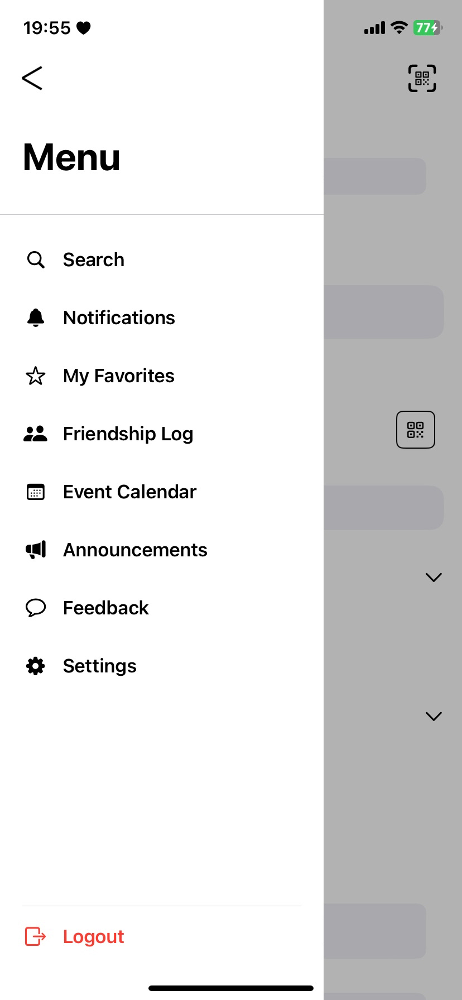
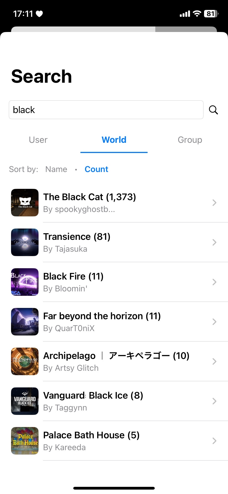

# VRCi  </img>

[🇺🇸 English](README.md) • [🇯🇵 日本語](README_ja.md) • [🇪🇸 Español](README_es.md) • [🇨🇳 中文](README_cn.md) • **🇰🇷 한국어**

**VRCi**는 SwiftUI로 제작된 iOS용 VRChat을 위한 차세대 친구 및 커뮤니티 관리 도구로, [**VRCX**](https://github.com/vrcx-team/VRCX)에서 영감을 받았습니다. 

이 **비공식 서드파티 애플리케이션**은 VRChat 생태계를 존중하며 여러분의 VRChat 경험을 향상시킵니다.

**iPhone 및 iPad 호환** • **iOS 18.0 이상 필요**

## 주요 기능

### **네이티브 iOS 경험**
- **웹 브라우저 불필요**: 네이티브 iOS 앱을 통해 모든 VRChat 기능에 직접 접근
- **즉시 친구 위치 추적**: 앱 전환 없이 실시간 친구 위치 확인

### **고급 친구 및 커뮤니티 관리**
- **실시간 친구 상태 업데이트**: WebSocket을 통한 실시간 친구 상태 업데이트
- **포괄적인 사용자 검색**: 강력한 검색 및 필터링 기능으로 모든 VRChat 사용자 검색
- **즐겨찾기 및 그룹 관리**: 친구, 월드, 아바타를 사용자 지정 그룹으로 정리
- **친구 관계 활동 추적**: 친구 요청, 추가, 삭제의 상세한 로그

### **월드 및 콘텐츠 탐색**
- **고급 월드 검색**: 상세한 필터링 및 정렬을 통한 월드 발견
- **콘텐츠 브라우징**: 앱 내에서 아바타, 월드, 그룹 탐색
- **즐겨찾기 관리**: 나중에 사용할 콘텐츠 저장 및 정리

### **원활한 연결성**
- **향상된 QR 코드 공유**: 아바타와 프로필 정보가 포함된 아름다운 맞춤형 QR 코드
- **QR 코드 스캐너**: VRCi QR 코드를 스캔하여 즉시 친구 추가
- **다중 계정 지원**: 최대 3개 계정의 안전한 저장 및 전환

*더 많은 기능을 발견해보세요!*

## 스크린샷

VRCi의 포괄적인 기능들을 살펴보세요:

<table align="center">
  <tr>
    <td align="center">
      <strong>메인 대시보드</strong> 
      
    </td>
    <td align="center">
      <strong>사이드 메뉴</strong> 
      
    </td>
    <td align="center">
      <strong>내 프로필</strong> 
      
    </td>
  </tr>
  <tr>
    <td align="center">
      <strong>프로필 편집</strong> 
      
    </td>
    <td align="center">
      <strong>친구 관계 로그</strong> 
      
    </td>
    <td align="center">
      <strong>QR 코드 공유</strong> 
      
    </td>
  </tr>
  <tr>
    <td align="center">
      <strong>월드 검색</strong> 
      
    </td>
    <td align="center">
      <strong>그룹 관리</strong> 
      
    </td>
    <td align="center">
      <strong>설정 및 환경설정</strong> 
      
    </td>
  </tr>
</table>

## 시스템 요구사항

- **플랫폼**: iPhone 및 iPad
- **iOS 버전**: iOS 18.0 이상
- **인터넷 연결**: VRChat API 접근을 위해 필요
- **저장 공간**: 약 50MB의 여유 공간

## 다운로드 및 설치

VRCi가 이제 App Store에서 제공됩니다! 간편하게 다운로드하고 설치하여 iOS 기기에서 향상된 VRChat 관리를 시작하세요.

**[App Store에서 VRCi 다운로드](https://apps.apple.com/us/app/vrci/id6746643250)**

## 법률 및 규정 준수

VRCi는 독립적으로 개발된 **비공식 서드파티 애플리케이션**이며 VRChat Inc.와 제휴하거나 보증받지 않습니다.

- **VRChat 서비스 약관 준수**
- **VRChat 커뮤니티 가이드라인 존중**
- **공개 API 엔드포인트만 사용**
- **사용자 개인 정보 및 데이터 보안 보호**
- **Apple App Store 가이드라인 준수**

### 법률 문서

**[서비스 약관](https://vrci-eula-deploy.vercel.app/terms)**  
VRCi 사용에 관한 완전한 약관

**[개인정보처리방침](https://vrci-eula-deploy.vercel.app/privacy)**  
데이터 수집, 사용 및 보호에 대한 상세 정보

*VRChat®은 VRChat Inc.의 등록 상표입니다.*

## 지원 및 피드백

VRCi가 App Store에서 정식 출시되었습니다! 사용자 여러분의 의견을 듣고 싶습니다. 여러분의 피드백이 앱을 계속 개선하는 데 도움이 됩니다.

### 연락 방법
- **App Store 리뷰**: App Store에서 직접 피드백을 남겨주세요
- **GitHub Issues**: 버그 신고 또는 기능 요청
- **GitHub Discussions**: 커뮤니티 대화에 참여
- **직접 연락**: vrci_admin@proton.me로 문의

### 기능 요청은 언제나 환영

저희는 VRCi를 개선할 방법을 끊임없이 찾고 있습니다! 새로운 기능이나 개선 사항에 대한 아이디어가 있다면 위의 채널을 통해 언제든지 알려주세요.

### 개발자 모집

**열정적인 iOS 개발자를 찾습니다!** 저희는 다음과 같은 분야에 열정을 가진 재능 있는 개발자들을 적극적으로 찾고 있습니다:
- **SwiftUI/UIKit 개발**
- **iOS 플랫폼 전문 지식**
- **VRChat 커뮤니티 참여**
- **오픈 소스 기여**

경험이 풍부하시든 이제 막 시작하셨든, VRChat 커뮤니티를 위한 놀라운 iOS 경험을 만드는 데 열정이 있다면 저희 팀에 합류해 주세요!

---

**VRCi를 다운로드해 주셔서 감사합니다!** 저희는 커뮤니티와 플랫폼 가이드라인을 모두 존중하는 iOS에서의 뛰어난 VRChat 동반 경험을 만들기 위해 최선을 다하고 있습니다.

### 법률 링크
[서비스 약관](https://vrci-eula-deploy.vercel.app/terms) • [개인정보처리방침](https://vrci-eula-deploy.vercel.app/privacy) • [VRChat 약관](https://hello.vrchat.com/legal) • [VRChat 커뮤니티 가이드라인](https://hello.vrchat.com/community-guidelines)

VRCi is not endorsed by VRChat and does not reflect the views or opinions of VRChat or anyone officially involved in producing or managing VRChat properties. VRChat and all associated properties are trademarks or registered trademarks of VRChat Inc. VRChat © VRChat Inc.